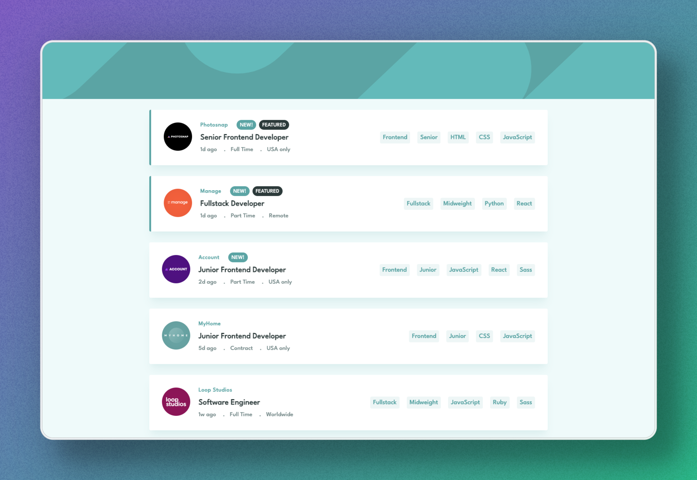

# Frontend Mentor - Job Listings with Filtering Solution

This is a solution to the [Job Listings with Filtering challenge on Frontend Mentor](https://www.frontendmentor.io/challenges/job-listings-with-filtering-ivstIPCt). Our team took on this challenge to improve our collaboration skills, enhance our frontend development knowledge, and build a real-world project together.

## Table of contents

- [Overview](#overview)
  - [The challenge](#the-challenge)
  - [Screenshot](#screenshot)
  - [Links](#links)
- [Our process](#our-process)
  - [Built with](#built-with)
  - [What we learned](#what-we-learned)
  - [Continued development](#continued-development)
  - [Useful resources](#useful-resources)
- [Contributors](#contributors)
- [Acknowledgments](#acknowledgments)

## Overview

### The challenge

Users should be able to:

- Filter job listings based on the selected categories.
- View the optimal layout for the interface depending on their device's screen size.
- See hover and focus states for all interactive elements on the page.

We used the provided `data.json` file to populate the content dynamically on the first load.

### Screenshot

*Add a screenshot of your solution. To take a full-page screenshot, use your browser's built-in screenshot tools or an extension like FireShot.*

### Links

- Solution URL: [Add solution URL here](https://your-solution-url.com)
- Live Site URL: [Add live site URL here](https://zeynabmvs.github.io/job-listing/)

## Our process

### Built with

- Semantic HTML5 markup
- CSS custom properties
- Flexbox & CSS Grid
- Mobile-first workflow
- [React](https://reactjs.org/) - JS library
- [Create React App](https://create-react-app.dev/) - Project setup
- [React DOM](https://reactjs.org/docs/react-dom.html) - Rendering library

### What we learned

This project helped us gain hands-on experience in:
- Managing state and filtering logic in React.
- Collaborating in a team using Git and GitHub.
- Structuring and organizing a frontend project efficiently.

### Continued development

Going forward, we plan to:
- Improve the UI/UX based on feedback.
- Optimize performance for large datasets.
- Experiment with different state management solutions like Zustand or Redux.

### Useful resources

- [React Docs](https://react.dev/) - Official documentation for React.
- [Frontend Mentor](https://www.frontendmentor.io/) - The source of this challenge.
- [MDN Web Docs](https://developer.mozilla.org/) - For HTML, CSS, and JavaScript references.

## Contributors

We worked on this project as a team to learn and improve our skills in frontend development and collaboration.

## Acknowledgments

A big thank you to all team members for their efforts and contributions. This project was an opportunity for us to practice working together, solve real-world frontend challenges, and refine our coding skills.

We also appreciate [Frontend Mentor](https://www.frontendmentor.io/) for providing high-quality challenges that help developers grow.
